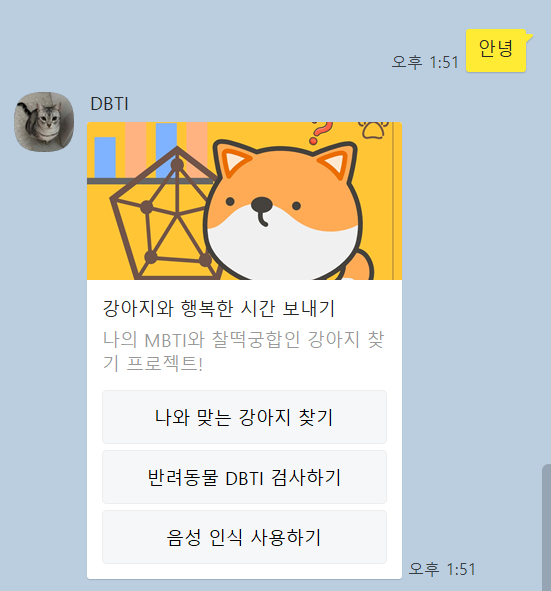

# DBTI

   
  
   

## 프로젝트 소개
<h3 align="justify">
내 성향에 맞는 강아지 찾기, 파이썬 카카오 챗봇 프로젝트
</h3>
 

## 프로젝트 목적

### 1. 이용자의 MBTI 성향에 맞는 견종 추천
### 2. 반려견 성격 유형 검사를 통해 반려견를 이해하고 맟춤형 교육과 훈련을 제공
### 3. STT를 사용하여 편리하고 접근성이 향상된 서비스를 제공

 

## 기술 스택

|                             Python                             |                               Flask                               |                         BeautifulSoup                          |                       Speech Recognition                       | CSV                                                             | Streamlit                                                      |
|:--------------------------------------------------------------:|:-----------------------------------------------------------------:|:--------------------------------------------------------------:|:--------------------------------------------------------------:|-----------------------------------------------------------------|----------------------------------------------------------------|
|  |  |  |  |  |  |

 

## 구현 기능

### 1. 나와 맞는 강아지 찾기

#이용자의 MBTI를 챗봇에 입력하면, 이용자의 성향과 맞는 견종을 추천, MBTI 검사를 할 수 있게 링크 버튼 제공

### 2. 반려동물 DBTI 검사하기

#DBTI를 검사한 후, 검사 완료 버튼을 누르면 DBTI 별칭과 성격 특징을 알려줌

### 3. 음성 인식 사용하기

#STT를 사용하여 MBTI와 DBTI를 인식 후 결과를 출력

 

## 배운 점 & 아쉬운 점

<h4 align="justify">
1. 사용자별로 DBTI 검사 결과 저장 : DBTI 검사 결과를 반환할 때 1개 값만 반환해 검사를 진행한 사용자별로 결과를 제공하는데 어려움이 있음 
2. 스킬서버 AWS로 변경 : 테스트 할때는 비용이 나가므로 Ngrok를 사용해서 스킬서버를 사용함. 실제 서비스에서는 AWS로 사용해야 한다. 
3. 챗봇에 한정되는게 아닌 플랫폼 서비스로 확장 : 맞춤형 사료, 장난감, 악세서리 또는 팁을 제공하거나 커뮤니티 기능을 추가하는 등의 플랫폼 서비스로 확장할 수 있음
</h4>

 

